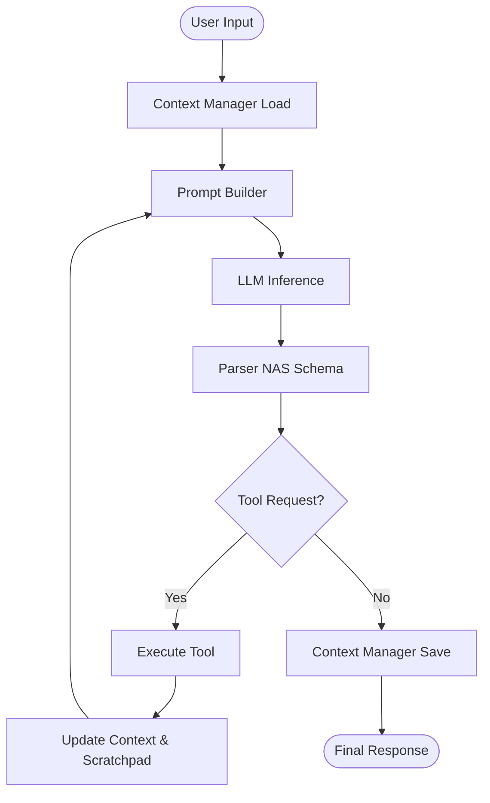

# Nova Agent Framework v2.0

## Overview

Nova is a high-performance JavaScript framework designed for building Reasoning Agents natively on Cloudflare Workers. Unlike standard chatbot libraries, Nova enforces a Recursive Thinking Loop. Agents built with Nova Think (Scratchpad), Remember (Dynamic Memory), and Research (Auto-Routing RAG) before formulating a final answer.

## Key Features

- **Recursive Reasoning Loop:** Iteratively calls tools and updates its internal "Scratchpad" before responding.
- **Unified Context Manager:** Manages Short-term (RAM), Long-term (KV/Vector), and External (RAG) context.
- **Dynamic Memory Strategy:** Summarizes conversation history when token budget is exceeded.
- **Smart RAG (SRS):** LLM Router selects the most relevant knowledge base pipeline.
- **NAS Schema Enforcement:** Ensures strict JSON output adherence.
- **Cloudflare AI Gateway:** Native integration for analytics, caching, and rate limiting.

## Installation

Install the framework in your Cloudflare Worker project:

```bash
npm install nova-agent-framework@latest
```

## Quick Start

Nova v2 uses a centralized Configuration Object (`nasRequest`) to reduce boilerplate. Memory, LLM, and Prompt classes are automatically instantiated.

### Worker Setup (src/worker.js)

```javascript
import { Pipeline } from 'nova-agent-framework';

export default {
    async fetch(request, env) {
        if (request.method === 'OPTIONS') return new Response(null, { headers: { 'Access-Control-Allow-Origin': '*' } });
        if (request.method !== 'POST') return new Response('Method Not Allowed', { status: 405 });

        let body;
        try { body = await request.json(); } catch { return new Response('Invalid JSON', { status: 400 }); }

        const nasRequest = {
            userPrompt: body.userPrompt,
            promptBuilderConfig: { systemPrompt: `You are a friendly customer support agent. Always use SRS for flavor questions.` },
            llmConfig: {
                model: env.LLM_MODEL,
                temperature: 0.7,
                maxOutputTokens: 512,
                api_keys: { groq: env.GROQ_KEY, openai: env.OPENAI_KEY, gemini: env.GEMINI_KEY },
                cloudflare: { accountId: env.CF_ACCOUNT_ID, gatewayId: env.CF_GATEWAY_NAME, cfAIGToken: env.CF_AIG_TOKEN }
            },
            ctxManagerConfig: {
                memory: { clientId: body.clientID, agentId: 'bot', memoryType: 'dynamic', limitTurns: 10, kvNamespace: env.KV_NAMESPACE },
                scratchpad: { clientId: body.clientID, agentId: 'bot', useScratchpad: true },
                srs: {
                    env: env,
                    pipelines: { nova: { binding: 'docs', description: 'Technical docs' }, store: { binding: 'store-inventory', description: 'pricing' } },
                    llmConfig: { model: env.LLM_MODEL, api_keys: { groq: env.GROQ_KEY } }
                }
            },
            maxToolLoop: 6
        };

        try {
            const pipeline = new Pipeline(nasRequest, 'parsed');
            const result = await pipeline.run();
            return new Response(JSON.stringify({ result: result.content }), { headers: { 'Content-Type': 'application/json', 'Access-Control-Allow-Origin': '*' } });
        } catch (err) {
            return new Response(JSON.stringify({ error: err.message }), { status: 500 });
        }
    }
};
```

## Configuration Reference

### nasRequest (Root Object)

| Property            | Type   | Required | Default | Description                        |
| ------------------- | ------ | -------- | ------- | ---------------------------------- |
| userPrompt          | string | Yes      | -       | The current user query             |
| promptBuilderConfig | Object | Yes      | -       | Configures agent persona           |
| llmConfig           | Object | Yes      | -       | AI model and keys                  |
| ctxManagerConfig    | Object | Yes      | -       | Memory, Scratchpad, and RAG config |
| maxToolLoop         | number | No       | 6       | Safety limit for tool recursion    |

### promptBuilderConfig

| Property     | Type    | Required | Description                       |
| ------------ | ------- | -------- | --------------------------------- |
| systemPrompt | string  | Yes      | Core personality and instructions |
| tools        | Object  | No       | Custom tool definitions           |
| debug        | boolean | No       | Logs constructed prompts if true  |

### llmConfig

| Property        | Type    | Required | Description                                   |
| --------------- | ------- | -------- | --------------------------------------------- |
| model           | string  | Yes      | Model ID                                      |
| api\_keys       | Object  | Yes      | Keys for AI providers                         |
| temperature     | number  | No       | Default 0.7                                   |
| maxOutputTokens | number  | No       | Default 1024                                  |
| cloudflare      | Object  | No       | Routes requests through Cloudflare AI Gateway |
| verbose         | boolean | No       | Logs full LLM requests                        |

### ctxManagerConfig

#### memory

| Property    | Type      | Required | Description                          |
| ----------- | --------- | -------- | ------------------------------------ |
| clientId    | string    | Yes      | Unique user ID                       |
| agentId     | string    | Yes      | Unique agent ID                      |
| kvNamespace | KVBinding | Yes      | Cloudflare KV binding                |
| limitTurns  | number    | No       | Number of turns to keep (default 10) |
| memoryType  | string    | No       | buffer, summary, dynamic             |

#### scratchpad

| Property      | Type    | Required | Description                       |
| ------------- | ------- | -------- | --------------------------------- |
| clientId      | string  | Yes      | Matches memory clientId           |
| agentId       | string  | Yes      | Matches memory agentId            |
| useScratchpad | boolean | No       | Enables reasoning (default false) |

#### srs

| Property  | Type   | Required | Description                  |
| --------- | ------ | -------- | ---------------------------- |
| env       | Object | Yes      | Worker environment object    |
| pipelines | Object | Yes      | Map of available RAG sources |
| llmConfig | Object | Yes      | LLM config for Router        |

## Architecture: NAS Loop



## Module Reference

- **Pipeline.js:** Orchestrates the recursive loop.
- **ContextManager.js:** Unifies ephemeral and persistent state.
- **Memory.js:** Handles conversation history and token optimization.
- **RAG.js:** Router and executor for semantic search.
- **LLM.js:** Unified interface for AI inference.
- **Parser.js:** Validates NAS JSON output.
- **PromptBuilder.js:** Constructs LLM prompts.

## Migration Guide (v1 → v2)

- Manual class instantiation removed.
- Dependency Injection via Configuration.
- Native SRS module included.

## Troubleshooting

- Invalid NAS JSON: use capable model, reduce temperature.
- Tool request loop exceeded: increase maxToolLoop or refine systemPrompt.
- SRS pipeline mismatch: ensure unique descriptions in srs.pipelines.

## License

Apache-2.0 License.

